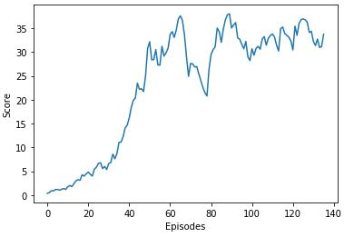

# Report

This notebook is the project summary report for the second project submission 'Continuous Control' for the Udacity Ud893 Deep Reinforcement Learning Nanodegree (DRLND). As such it includes a decription of the implementation, learning algorithm(s), hyperparameters, neural net model architectures, reward/episode plots and ideas for future work.

## Implementation

### Goal and Environment

This project will use the [Reacher environment](https://github.com/Unity-Technologies/ml-agents/blob/main/docs/Learning-Environment-Examples.md#reacher).


In this environment, a double-jointed arm can move to target locations. A reward of +0.1 is provided for each step that the agent's hand is in the goal location. Thus, the goal of your agent is to maintain its position at the target location for as many time steps as possible.

The observation space consists of 33 variables corresponding to position, rotation, velocity, and angular velocities of the arm. Each action is a vector with four numbers, corresponding to torque applicable to two joints. Every entry in the action vector should be a number between -1 and 1.

#### Distributed Training

There are two versions of this environment - a single agent and a twenty agent version (each with its own copy of the environment). The second twenty agent version is useful for algorithms that use multiple (non-interactive parallel) copies of the same agent to distribute the task of gathering experience.

#### Environment Solution

For the single agent implementation, the task is episodic and in order to solve the environment, the agent must attain an average score of +30 over 100 consecutive episodes.

This submission will solve the twenty agent version of the environment. In this case, the 20 agents must acheive an average score of +30 over 100 consecutive episodes in order to solve the environment. Specifically, after each episode, we add up the rewards that each agent received to get a final episodic score for each agent. These 20 potentially different episodic scores are then averaged, resulting in an overall average score over all agents for the episode. An overall average score of +30 over 100 consecutive episodes is considered as solving the environment.

### Files

The following provides a list of the key files and directories in the main project directory and their function.

| <p align="left">Filename</p>                  | <p align="left">Function</p>                            |
| :-------------------------------------------- | :------------------------------------------------------ |
| <p align="left">README.md</p>                 | <p align="left">Main readme</p>                         |
| <p align="left">Report.md</p>                 | <p align="left">Report readme markdown</p>              |
| <p align="left">P2.ipynb</p>                  | <p align="left">Main training loop python notebook</p>  |
| <p align="left">ddpg_agent_20.py</p>          | <p align="left">DDPG agent python file</p>              |
| <p align="left">model_20.py</p>               | <p align="left">Python Pytorch neural network file</p>  |
| <p align="left">\*.pth</p>                    | <p align="left">Saved Pytorch model files</p>           |
| <p align="left">Reacher_20_Windows_x86_64</p> | <p align="left">Bananas Unity environment directory</p> |
| <p align="left">/python</p>                   | <p align="left">Additional dependencies directory</p>   |

### Adaption

As suggested in the project instructions, an approach adapting the code from the DDPG implementation of the Actor-Critic Methods lesson, where a DDPG implementation was applied to the OpenAI Gym Pendulum-v0 environment, is employed as the basis for implementing the agent algorithms to solve the 20 agent version of the Reacher environment in this submission (Reacher_20). The following [reference paper](https://arxiv.org/pdf/1509.02971.pdf) is also used as a resource for the adaption and implementation details.

The main training loop function `ddpg`, renamed as `training_loop_20` in the main training loop notebook file `P2.ipynb`, was then modified to work with the provided unity Reacher_20 environment as it's API is slightly different than the way OpenAI gym works. This essentially boils down to replacing statements as follows -

```python
# instantiating environment
# OpenAI replace
env = gym.make('Pendulum-v0')
state = env.reset()
# with Unity
env = UnityEnvironment(file_name="Reacher_20_Windows_x86_64/Reacher.exe")
brain_name = env.brain_names[0]
brain = env.brains[brain_name]

# reset environment
# OpenAI replace
state = env.reset()
# with Unity
env_info = env.reset(train_mode=False)[brain_name]
state = env_info.vector_observations

# step environment
# OpenAI replace
next_state, reward, done, _ = env.step(action)
# with Unity
env_info = env.step(action)[brain_name]
next_state = env_info.vector_observations
reward = np.float64(env_info.rewards)
done = env_info.local_done
```

In addition to the above, a slight modification was employed to keep track of the scores, as the reward is returned as a tensor of length 20 (see `training_loop_20` in the main training loop notebook file `P2.ipynb`).

### Agent Algorithms & Neural Net Models

As previously mentioned, it was decided to use the DDPG algorithm to solve the Reacher_20 environment. The following table outlines the associated file and class names, and includes a link to the papers where the algorithms are outlined.

| <p align="left">Agent Algorithm</p> | <p align="left">Published Algorithm Source </p>                                                             | <p align="left">File Name</p>        | <p align="left">Function Class</p> |
| :---------------------------------- | :---------------------------------------------------------------------------------------------------------- | :----------------------------------- | :--------------------------------- |
| <p align="left">DDPG </p>           | <p align="left">[Playing Atari with Deep Reinforcement Learning](https://arxiv.org/pdf/1509.02971.pdf) </p> | <p align="left">ddpg_agent_20.py</p> | <p align="left">Agent</p>          |

The following sections provide a short discussion of the developed agent implementation and the model used.

#### Model

The neural network models for these agents are in the `model_20.py` file. The agent uses the `Actor` and `Critic` classes from the `model_20.py` file. The `Actor` and `Critic` classes are the unmodified classes from the original DDPG project exercise solution with the inclusion of a the batch normalization technique outlined in the above mentioned [DDPG paper](https://arxiv.org/pdf/1509.02971.pdf). This batch normalization technique is used to reduce internal covariate shift and is outlined in the following [Batch Normalization paper](https://arxiv.org/pdf/1502.03167.pdf).

A block diagram of the `Actor` class model is show in the following figure.


The following code snippet provides the Actor model code:

```python
class Actor(nn.Module):
    """Actor (Policy) Model."""

    def __init__(self, state_size, action_size, seed, fc1_units=400, fc2_units=300):
        """Initialize parameters and build model.
        Params
        ======
            state_size (int): Dimension of each state
            action_size (int): Dimension of each action
            seed (int): Random seed
            fc1_units (int): Number of nodes in first hidden layer
            fc2_units (int): Number of nodes in second hidden layer
        """
        super(Actor, self).__init__()
        self.seed = torch.manual_seed(seed)
        self.bn0 = nn.BatchNorm1d(state_size)
        self.fc1 = nn.Linear(state_size, fc1_units)
        self.bn1 = nn.BatchNorm1d(fc1_units)
        self.fc2 = nn.Linear(fc1_units, fc2_units)
        self.bn2 = nn.BatchNorm1d(fc2_units)
        self.fc3 = nn.Linear(fc2_units, action_size)
        self.reset_parameters()

    def reset_parameters(self):
        self.fc1.weight.data.uniform_(*hidden_init(self.fc1))
        self.fc2.weight.data.uniform_(*hidden_init(self.fc2))
        self.fc3.weight.data.uniform_(-3e-3, 3e-3)

    def forward(self, state):
        """Build an actor (policy) network that maps states -> actions."""
        x = self.bn0(state)
        x = F.relu(self.bn1(self.fc1(x)))
        x = F.relu(self.bn2(self.fc2(x)))
        return torch.tanh(self.fc3(x))
```

A block diagram of the `Critic` class model is show in the following figure.


The following code snippet provides the Critic model code:

```python
class Critic(nn.Module):
    """Critic (Value) Model."""

    def __init__(self, state_size, action_size, seed, fcs1_units=400, fc2_units=300):
        """Initialize parameters and build model.
        Params
        ======
            state_size (int): Dimension of each state
            action_size (int): Dimension of each action
            seed (int): Random seed
            fcs1_units (int): Number of nodes in the first hidden layer
            fc2_units (int): Number of nodes in the second hidden layer
        """
        super(Critic, self).__init__()
        self.seed = torch.manual_seed(seed)
        self.bn0 = nn.BatchNorm1d(state_size)
        self.fcs1 = nn.Linear(state_size, fcs1_units)
        self.fc2 = nn.Linear(fcs1_units+action_size, fc2_units)
        self.fc3 = nn.Linear(fc2_units, 1)
        self.reset_parameters()

    def reset_parameters(self):
        self.fcs1.weight.data.uniform_(*hidden_init(self.fcs1))
        self.fc2.weight.data.uniform_(*hidden_init(self.fc2))
        self.fc3.weight.data.uniform_(-3e-3, 3e-3)

    def forward(self, state, action):
        """Build a critic (value) network that maps (state, action) pairs -> Q-values."""
        state = self.bn0(state)
        xs = F.relu(self.fcs1(state))
        x = torch.cat((xs, action), dim=1)
        x = F.relu(self.fc2(x))
        return self.fc3(x)
```

#### DDPG Agent

As previously discussed, an approach using the code from the DDPG implementation of the Actor-Critic Methods lesson, where a DDPG implementation was applied to the OpenAI Gym Pendulum-v0 environment, is employed as the basis for implementing the agent algorithms. This DDPG agent code served as the starting point for solving the Reacher_20 environment.

The agent code (see agent python file) parameters were modified so that the actor and critic learning rates, L2 weight decay, and number of neural net nodes used in the neural net model could be passed to the agent at instantiation, as follows:

```python
class Agent():
    """Interacts with and learns from the environment."""

    def __init__(self, state_size, action_size, random_seed, lr_a=LR_ACTOR, lr_c=LR_CRITIC, weight_decay=WEIGHT_DECAY, fc1_units=400, fc2_units=300):
        """Initialize an Agent object.

        Params
        ======
            state_size (int): dimension of each state
            action_size (int): dimension of each action
            random_seed (int): random seed
            lr_a (float): learning rate for actor
            lr_c (float): learning rate for critic
            weight_decay: L2 weight decay
            fc1_units (int): Number of nodes in first hidden layer
            fc2_units (int): Number of nodes in second hidden layer
        """
```

This provides the ability to help manually fine tune some system and hyperparameters and improve performance.

Additionally, as there are 20 agents in the Reacher_20 environment, and the state, reward and done are returned as tensors with 20 entries (one for each of the 20 environments), a modification was made to the `step` method of the `Agent` class that loops through these tensors and saves them as individual state, action, reward, etc. tuples to the replay buffer (as would be the case for a single agent). The following outlines this modification.

```python
    def step(self, state, action, reward, next_state, done, timestep):
        """Save experience in replay memory, and use random sample from buffer to learn."""
        # Save experience / reward
        # self.memory.add(state, action, reward, next_state, done)

        for s, a, r, ns, d in zip(state, action, reward, next_state, done):
            self.memory.add(s, a, r, ns, d)
```

This therefore allows us to treat the environment as though it was a single agent while learning.

#### Hyper-parameters

The following table lists the hyper-parameters that were modified in the process of solving the Reacher_20 environment.

| <p align="left">Hyper-parameter</p> | <p align="left">Value</p> | <p align="left">Function</p>                         |
| ----------------------------------- | ------------------------- | ---------------------------------------------------- |
| <p align="left">BUFFER_SIZE</p>     | <p align="left">1e5</p>   | <p align="left">Replay buffer size</p>               |
| <p align="left">BATCH_SIZE</p>      | <p align="left">256</p>   | <p align="left">Minibatch size</p>                   |
| <p align="left">GAMMA</p>           | <p align="left">0.99</p>  | <p align="left">Discount factor</p>                  |
| <p align="left">TAU</p>             | <p align="left">1e-3</p>  | <p align="left">Soft update of target parameters</p> |
| <p align="left">LR_ACTOR</p>        | <p align="left">1e-4</p>  | <p align="left">Learning rate for Actor</p>          |
| <p align="left">LR_CRITIC</p>       | <p align="left">1e-3</p>  | <p align="left">Learning rate for Critic</p>         |
| <p align="left">WEIGHT_DECAY</p>    | <p align="left">1e-2</p>  | <p align="left">L2 weight decay</p>                  |
| <p align="left">FC1</p>             | <p align="left">400</p>   | <p align="left">Hidden layer 1 nodes</p>             |
| <p align="left">FC2</p>             | <p align="left">300</p>   | <p align="left">Hidden layer 2 nodes</p>             |

The above `values` column are the starting point values. A later section below provides details on the modifications of these values.

## Running the Notebook

The `P2.ipynb` jupyter notebook is composed of the following cells:

| &nbsp;                | <p align="left">Cell Name</p>                   | <p align="left">Function</p>                                           |
| --------------------- | ----------------------------------------------- | ---------------------------------------------------------------------- |
| <p align="left">1</p> | <p align="left">Imports and Dependencies</p>    | <p align="left">Import libraries, etc</p>                              |
| <p align="left">2</p> | <p align="left">Unity Environment</p>           | <p align="left">Instantiate Unity environment</p>                      |
| <p align="left">3</p> | <p align="left">Get Default Brain</p>           | <p align="left">Get brain instance</p>                                 |
| <p align="left">4</p> | <p align="left">Main Training Loop Function</p> | <p align="left">Runs main training loop, called by following cells</p> |
| <p align="left">5</p> | <p align="left">DDPG Agent</p>                  | <p align="left">Initiates training</p>                                 |
| <p align="left">6</p> | <p align="left">Run Smart Agent</p>             | <p align="left">Visual test</p>                                        |

Load the `P2.ipynb` jupyter notebook and initialize the overall environment by running items 1 through 4 in the above table. Once this is done, you can train the agent (items 5) or just run the trained agent (item 10).

In the case of all the test runs that were done, the notebook kernal was restarted and items 1 through 4 were rerun before training. I had the impression that doing that resulted in better results and therefore wanted to start the different training sessions from the same starting point. However, this wasn't investigated thoroughly. I leave it up to the user to decide whether a notebook kernal restart is done when starting a new agent training session.

## Results

A large number of training runs were done, beginning with the default hyper-parameters outlined in the above `Hyper-parameter` section. The following table provides a small number of the more salient runs which provide an idea of the overall evolution of the hyper-parameter choices.

| <p align="left">Scenario</p> | <p align="left">LR_ACTOR/LR_CRITIC</p> | <p align="left">FC1/FC2</p> | <p align="left">WEIGHT_DECAY</p> | <p align="left">BATCH_SIZE</p> | <p align="left">Noise reset</p> | <p align="left">Episodes</p> | <p align="left">Av score</p> |
| ---------------------------- | -------------------------------------- | --------------------------- | -------------------------------- | ------------------------------ | ------------------------------- | ---------------------------- | ---------------------------- |
| <p align="left">A</p>        | <p align="left">1e-4/1e-3</p>          | <p align="left">400/300</p> | <p align="left">1e-2</p>         | <p align="left">256</p>        | <p align="left">No</p>          | <p align="left">>>111</p>    | <p align="left">0.59</p>     |
| <p align="left">B</p>        | <p align="left">1e-4/1e-3</p>          | <p align="left">400/300</p> | <p align="left">0</p>            | <p align="left">256</p>        | <p align="left">No</p>          | <p align="left">>>103</p>    | <p align="left">2.96</p>     |
| <p align="left">C</p>        | <p align="left">1e-4/1e-3</p>          | <p align="left">400/300</p> | <p align="left">0</p>            | <p align="left">128</p>        | <p align="left">Yes</p>         | <p align="left">>>215</p>    | <p align="left">6.08</p>     |
| <p align="left">D</p>        | <p align="left">1e-4/1e-3</p>          | <p align="left">400/300</p> | <p align="left">1e-2</p>         | <p align="left">256</p>        | <p align="left">Yes</p>         | <p align="left">>>93</p>     | <p align="left">0.62</p>     |
| <p align="left">E</p>        | <p align="left">1e-4/1e-3</p>          | <p align="left">128/128</p> | <p align="left">1e-2</p>         | <p align="left">256</p>        | <p align="left">Yes</p>         | <p align="left">>>109</p>    | <p align="left">0.36</p>     |
| <p align="left">F</p>        | <p align="left">1e-4/1e-3</p>          | <p align="left">128/128</p> | <p align="left">0</p>            | <p align="left">256</p>        | <p align="left">Yes</p>         | <p align="left">146</p>      | <p align="left">30</p>       |
| <p align="left">G</p>        | <p align="left">1e-3/1e-3</p>          | <p align="left">128/128</p> | <p align="left">0</p>            | <p align="left">256</p>        | <p align="left">Yes</p>         | <p align="left">139</p>      | <p align="left">30</p>       |
| <p align="left">H</p>        | <p align="left">1e-4/1e-3</p>          | <p align="left">400/300</p> | <p align="left">0</p>            | <p align="left">256</p>        | <p align="left">Yes</p>         | <p align="left">129</p>      | <p align="left">30</p>       |
| <p align="left">I</p>        | <p align="left">1e-4/1e-3</p>          | <p align="left">400/300</p> | <p align="left">0</p>            | <p align="left">256</p>        | <p align="left">Yes</p>         | <p align="left">>>310</p>    | <p align="left">12.92</p>    |
| <p align="left">J</p>        | <p align="left">1e-4/1e-3</p>          | <p align="left">400/300</p> | <p align="left">0</p>            | <p align="left">256</p>        | <p align="left">Yes</p>         | <p align="left">123</p>      | <p align="left">30</p>       |

Assume that hyper-parameters not mentioned in the above table take on the default values from the `Hyper-parameter` section table.

Initial runs started with scenario `A` (above table) and resulted in average scores of less than 1 after many episodes. Focusing on the WEIGHT_DECAY hyper-parameter eventually lead to better results (`B`) with the WEIGHT_DECAY set to 0. Further research led to reseting the mean of the noise to 0 in the `Ornstein-Uhlenbeck` process after each learning cycle in the `learn` method of the `agent`, hence the column for `Noise reset` in the above table.

Scenarios `C` through `F` highlight some results of continued changes to the WEIGHT_DECAY and other hyper-parameters until the environment is solved (note that these are a subset of highlights from maybe 30+ different runs with hyper-parameter changes) in 146 episodes.

Scenarios `G` and `H` further improved the number of episodes due to changes to the learning rates and number of nodes in the layers of the neural network models.

I found that the episode curves for solutions were not as smooth or as stable as I would've like them to be, so I continued with other possibilities.

Scenario `I` is an attempt at further improving the solution by incorporating some of the methods outlined in the `Benchmark Implementation` (section 6) of the Concepts section from the Udacity Ud893 Deep Reinforcement Learning Nanodegree (DRLND) `Project: Continuous Control` outline. Specifically, this entailed employing gradient clipping when training the critic network and being less aggressive with the number of updates per update step (10 times after every 20 timesteps). This resulted in a smoother overall episode curve, however, the run was stopped after 310 episodes. Code for this can be found in the `step` method of the `Agent` class (currently commented out).

Scenario `J` was based on applying a decay to the addition of the noise to the action in the `act` method of the `Agent`. This resulted in a smaller number of episodes and a slightly smoother episode curve. Code for this can be found in the `__init__`, `act`, and end of `learn` methods in the `Agent` (see self.epsilon - currently commented out).

The following are plots of the F, G, I and J scenarios.

Scenario F


Scenario G



Scenario I


Scenario J


## Discussion and Ideas for Future Work

Generally, the agents provided reasonable results with episode numbers as low as 123. Further experimentation/investigation with other hyper-parameters such as `sigma` in the `Ornstein-Uhlenbeck` noise section, `tau` in the soft update section, or including `reward scaling`, could potentially improve overall performance.

As for other future work, I'd like to delve deeper into why I didn't achieve the same results as the `Benchmark Implementation` that I tried in Scenario `I` of the previous section. I've noticed discrepencies when using GPUs vs. CPUs to solve these environments and therefore would like to understand that a little more.

I tried training the single environment Reacher version once I finished with the 20 environment version and results were not very good. So future work would include figuring out a DDPG solution for the single agent Reacher environment.

I'd also like to implement other algorithms such as TRPO, TNPG, PPO, A3C, and D4PG and do an overall comparison of these algorithms. It would be interesting to see if the results line up at all with the results obtained with TNPG, TRPO and DDPG in the paper on [Benchmarking Deep RL for Continuous Control](https://arxiv.org/pdf/1604.06778.pdf), cited in the `Not sure where to start` (section 7) of the Concepts section, although they haven't benchmarked the Reacher environment.

Future work could also be to attack the `Crawl` challenge and, finally, I'd like to apply some of these algorithms to pixel based images where convolutional neural networks are used.
